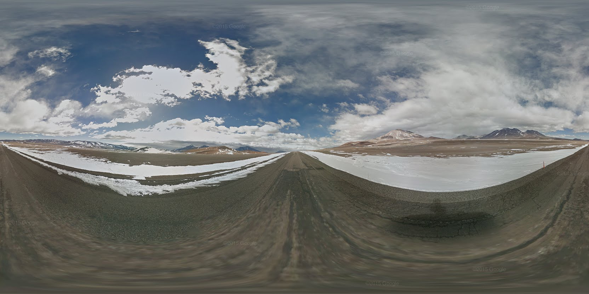
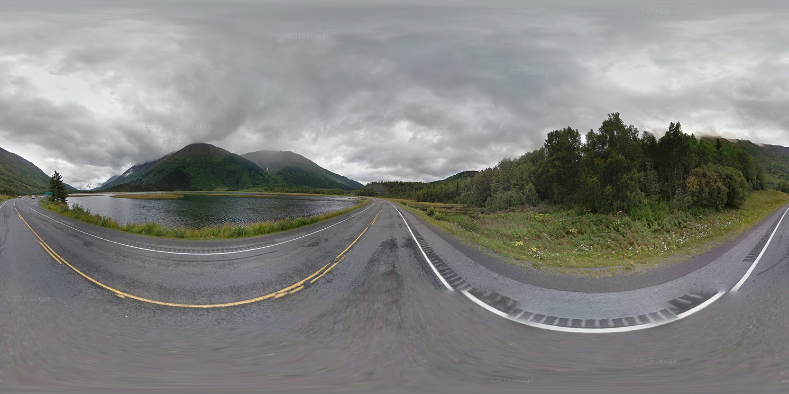
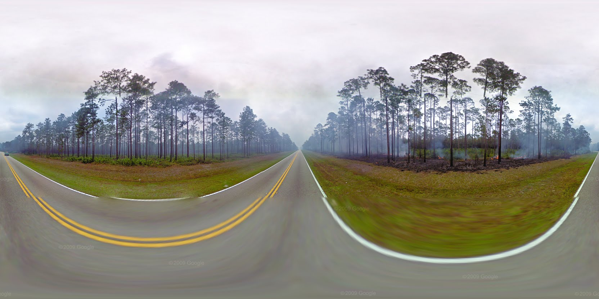

# gpano-streetview

## Sử dụng API của Google StreetView để get ảnh Panorama theo tọa độ 

## 1. Các modules
- getTileData : dùng để get bố cục khung panorama.
- get-panorama-by-location : trả về id của location
- getPanoURL : trả về url của từng hình nhỏ 
- canvas : dùng để merge nhiều hình thành hình panorama
** hướng dẫn cài đặt canvas ** [https://github.com/Automattic/node-canvas/wiki](https://github.com/Automattic/node-canvas/wiki)

## 2. API
GET / ?zoom=zoom&lat=lat&lng=lng

ex : GET toanalien.xyz/?zoom=2&lat=51.50700703827454&lng=-0.12791916931155356

## 3. Ví dụ

